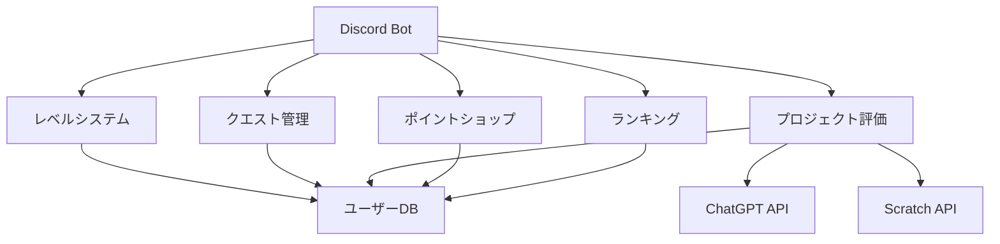
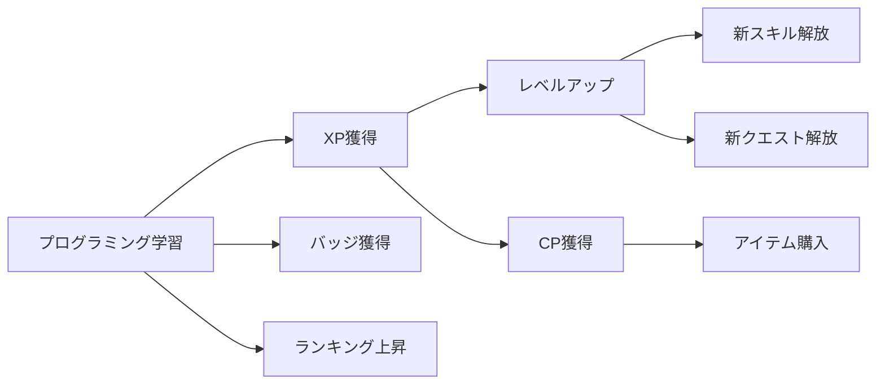
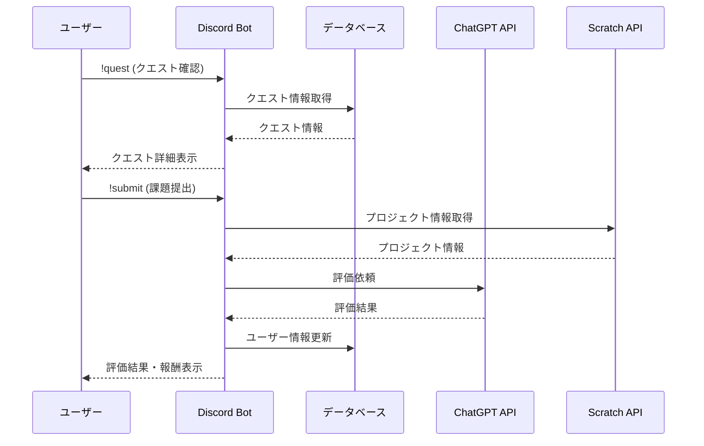
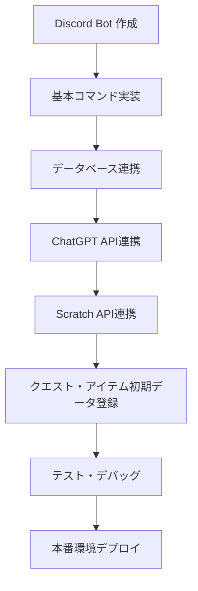

# コードクエスト - Discord x Scratch x ChatGPT 連携システム

## 📋 プロジェクト概要

**コードクエスト**は、子ども向けプログラミング教室のためのDiscord Botシステムです。Scratch、ChatGPT、Discordを連携させ、ゲーミフィケーション要素を取り入れた学習体験を提供します。

RPG風の世界観で設計されており、子どもたちは「プログラミングの冒険者」として成長していきます。プログラミングの課題は「クエスト」として提示され、完了すると経験値やポイントを獲得できます。



## 🏗️ システムアーキテクチャ

| コンポーネント | 技術 | 役割 |
| --- | --- | --- |
| 🤖 Discord Bot | Node.js, discord.js | ユーザーインターフェース・コマンド処理 |
| 🧠 ChatGPT連携 | OpenAI API | 質問応答・プロジェクト評価 |
| 🧩 Scratch連携 | Scratch API | プロジェクト情報取得・分析 |
| 💾 データベース | MongoDB | ユーザー情報・クエスト・アイテム管理 |

## 🎮 ゲーミフィケーション要素



## 📱 UI/UX デザイン

### Discord チャンネル構成

```
🏠 メイン
 ├── 📢 お知らせ
 ├── 👋 自己紹介
 ├── 🤖 bot-コマンド
 └── 💬 雑談

🎮 プログラミング学習
 ├── 📝 課題説明
 ├── 🚀 課題提出
 ├── 🔍 質問相談
 └── 💡 アイデア共有

🏆 ゲーミフィケーション
 ├── 🎖️ ランキング
 ├── 📊 マイステータス
 ├── 🎁 報酬ショップ
 └── 🎲 ミニゲーム
```

### 主要画面サンプル

#### プロフィール画面

```
┏━━━━━━━━━━━━━━━━━━━━━━━━━━━━━━━━━━━━━━━━━━━━━━━━━━┓
┃             🌟 コードクエスト冒険手帳 🌟            ┃
┃                                                    ┃
┃  【冒険者情報】                                     ┃
┃   名前: ゆうきくん                                  ┃
┃   ランク: プログラム魔法使い                        ┃
┃   レベル: 7                                        ┃
┃   経験値: ■■■■■■□□□□ 350/500                     ┃
┃   所持CP(コードポイント): 750                       ┃
┃                                                    ┃
┃  【習得スキル】                                     ┃
┃   ✅ Scratch基本動作        ✅ アニメーション技術    ┃
┃   ✅ ゲーム設計の基礎       ✅ 物語創作術           ┃
┃   ✅ 条件分岐の魔法         ✅ 変数の操作術         ┃
┃                                                    ┃
┃  【所持バッジ】                                     ┃
┃   🎮 ゲームクラフター       🎨 創造の筆             ┃
┃   🎵 音楽の魔術師          🤖 AIの友               ┃
┃                                                    ┃
┃  【次のクエスト】                                   ┃
┃   「音と動きの冒険」- あと3日                       ┃
┗━━━━━━━━━━━━━━━━━━━━━━━━━━━━━━━━━━━━━━━━━━━━━━━━━━┛
```

#### クエスト詳細画面

```
┏━━━━━━━━━━━━━━━━━━━━━━━━━━━━━━━━━━━━━━━━━━━━━━━━━━┓
┃                 📜 クエスト詳細 📜                  ┃
┃                                                    ┃
┃  【クエスト名】音と動きの冒険                        ┃
┃                                                    ┃
┃  【ストーリー背景】                                 ┃
┃   魔法の森では、動物たちが魔法によって踊ることが     ┃
┃   できなくなってしまいました。あなたはプログラミング  ┃
┃   の力で、動物たちに音楽と共に踊る喜びを             ┃
┃   取り戻してあげましょう。                          ┃
┃                                                    ┃
┃  【クエスト目標】                                   ┃
┃   1. 最低2種類の動物キャラクターを作成する           ┃
┃   2. 音楽が流れるとキャラクターが踊るようにする      ┃
┃   3. キャラクターをクリックすると動きが変わるようにする┃
┃                                                    ┃
┃  【使うべき魔法（ブロック）】                        ┃
┃   • イベントブロック                               ┃
┃   • 音を鳴らすブロック                             ┃
┃   • 見た目を変えるブロック                          ┃
┃                                                    ┃
┃  【報酬】                                          ┃
┃   • 50 XP                                         ┃
┃   • 100 CP                                        ┃
┃   • 「音楽の魔術師」バッジ                          ┃
┃                                                    ┃
┃  【提出方法】                                       ┃
┃   !submit [ScratchプロジェクトのURL]                ┃
┗━━━━━━━━━━━━━━━━━━━━━━━━━━━━━━━━━━━━━━━━━━━━━━━━━━┛
```

## 💻 機能一覧

| コマンド | 説明 | ユーザー体験 |
| --- | --- | --- |
| `!profile` | プロフィール表示 | 🔍 自分の進捗確認 |
| `!quest` | 課題確認 | 📝 次の目標を知る |
| `!submit` | 課題提出 | 🎯 成果を評価してもらう |
| `!ask` | AI質問 | 🧠 分からないことを質問 |
| `!shop` | ショップ表示 | 🛒 報酬でアイテム購入 |
| `!rank` | ランキング表示 | 🏆 他の学習者と比較 |
| `!help` | ヘルプ表示 | 📚 使い方を学ぶ |

## 🔄 データフロー



## 📊 レベルとポイントシステム

| レベル | 必要XP | ランク | 解放スキル |
| --- | --- | --- | --- |
| 1 | 0 | プログラム見習い | - |
| 2 | 100 | プログラム見習い | Scratch基本動作 |
| 3 | 250 | コード探検家 | アニメーション技術 |
| 5 | 600 | デジタル冒険者 | 条件分岐の魔法 |
| 7 | 1100 | プログラム魔法使い | 変数の操作術 |
| 9 | 1750 | コードウィザード | ゲーム設計の基礎 |
| 11 | 2600 | 魔法プログラマー | 物語創作術 |
| 15 | 4250 | 伝説のコードマスター | 関数の秘術 |

## 🚀 実装フロー



## 🔧 技術スタック詳細

- **バックエンド**: Node.js, Express.js
- **Discord連携**: discord.js
- **データベース**: MongoDB, Mongoose
- **AI連携**: OpenAI Node.js SDK
- **外部API連携**: node-fetch
- **デプロイ**: Heroku または VPS

## 🎯 教育効果

- **プログラミング思考**: 論理的思考・問題解決力
- **創造性**: オリジナル作品作り・表現力
- **AI活用**: 最新技術との協働体験
- **コミュニケーション**: 発表・共有する力
- **継続的学習**: ゲーミフィケーションによるモチベーション維持

## 💼 セットアップ手順

1. リポジトリをクローン: `git clone https://github.com/yourname/codequest.git`
2. 依存関係インストール: `npm install`
3. 環境変数設定: `.env`ファイル作成
4. データベース接続設定
5. ボット起動: `npm start`

## 📱 拡張可能性

- **親向けポータル**: 子どもの進捗確認
- **チーム制**: グループでのプロジェクト制作
- **特別イベント**: 季節やテーマに合わせた限定クエスト
- **リアルタイム協力**: ボイスチャットでのペアプログラミング
- **作品コンテスト**: 定期的な作品コンテスト開催