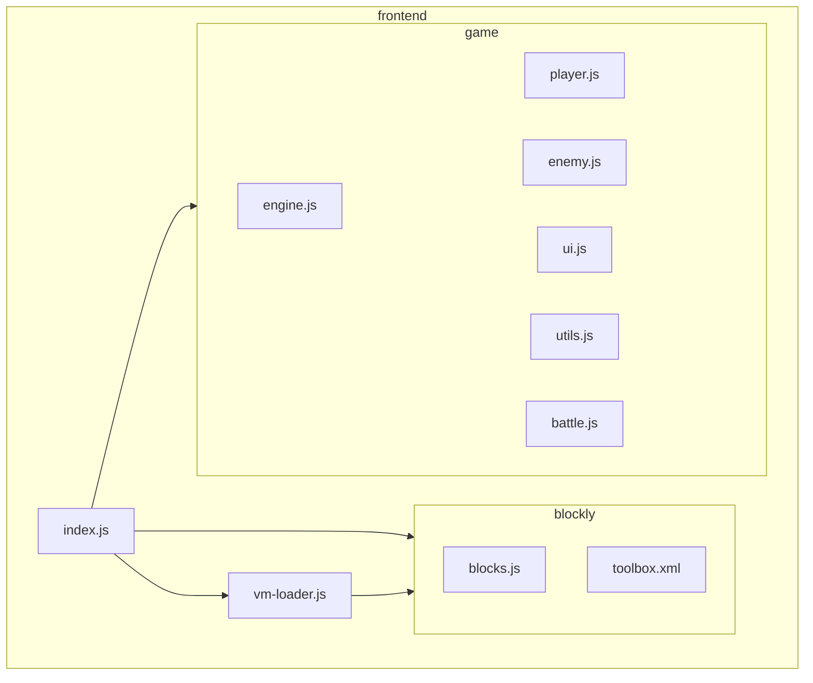
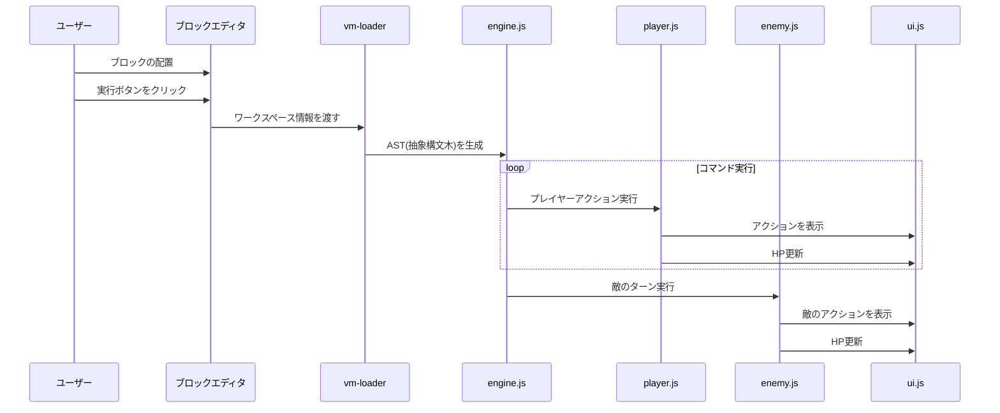
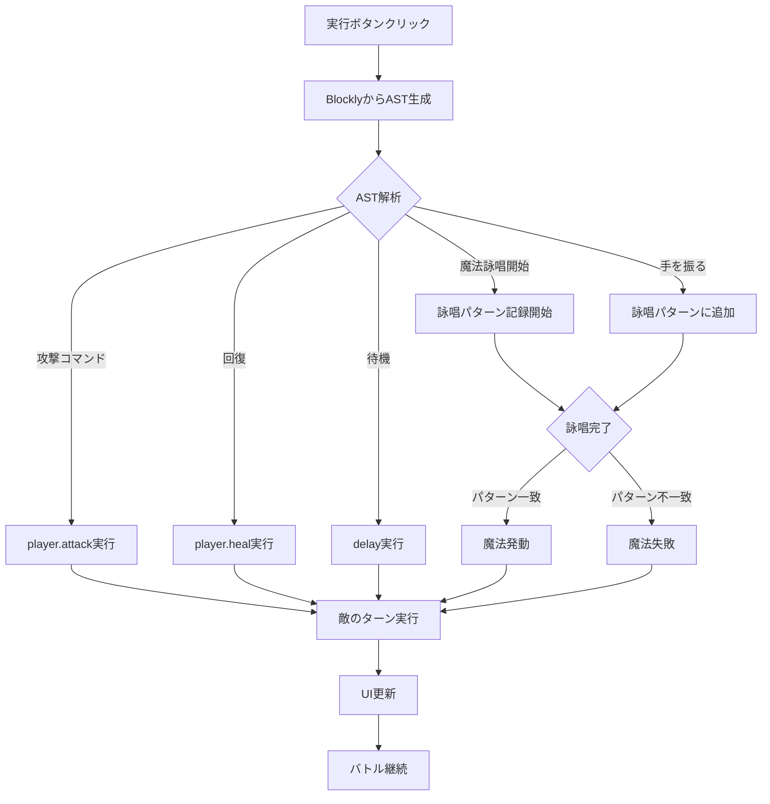
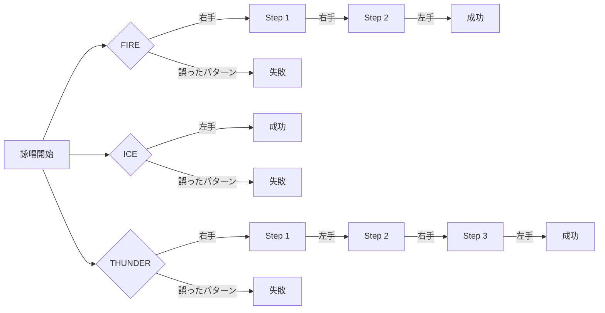

# ブロックプログラミングバトルゲーム

## プロジェクト概要

ブロックプログラミングを使って魔法詠唱や戦略を組み立てて敵と戦うバトルゲームです。Scratch風のブロックエディタで戦闘コマンドを作成し、実行することで敵とバトルすることができます。

---

## プロジェクト構造図



## 実行フロー



---

## フォルダ構成

```
my-blocks-game/
├── frontend/                   # フロントエンドアプリケーション
│   ├── public/                 # 静的ファイル
│   │   └── index.html          # メインHTMLファイル
│   ├── src/                    # ソースコード
│   │   ├── blockly/            # Blockly関連ファイル
│   │   │   ├── blocks.js       # カスタムブロック定義
│   │   │   └── toolbox.xml     # ブロックツールボックス設定
│   │   ├── game/               # ゲームロジック
│   │   │   ├── battle.js       # バトルシーン
│   │   │   ├── enemy.js        # 敵キャラクターロジック
│   │   │   ├── engine.js       # ゲーム実行エンジン
│   │   │   ├── player.js       # プレイヤーロジック
│   │   │   ├── ui.js           # UI管理
│   │   │   └── utils.js        # ユーティリティ関数
│   │   ├── vm/                 # 実行エンジン
│   │   │   └── vm-loader.js    # BlocklyからAST生成
│   │   ├── index.js            # アプリケーションエントリーポイント
│   │   └── style.css           # スタイル定義
│   ├── package.json            # npm依存関係
│   └── webpack.config.js       # Webpackビルド設定
└── wasm-game-core/             # Rust/WASM機能
    ├── src/                    # Rustソース
    │   └── lib.rs              # WASMエクスポート関数
    └── Cargo.toml              # Rust依存関係
```

---

## 各ファイルの役割

### フロントエンド

#### `index.html`
- **役割**: アプリケーションのメインHTML構造を定義。HPバー、ゲームキャンバス、ブロックエディタを配置
- **実行時**: ページロード時に最初に読み込まれ、DOMツリーを構築

#### `index.js`
- **役割**: アプリケーションのエントリーポイント。Blocklyの初期化、Phaserゲームの設定、イベントハンドラの設定
- **実行時**: HTML読み込み後に`window.onload`で実行され、ゲーム全体を初期化

#### `blocks.js`
- **役割**: Scratch-Blocksライブラリで使用するカスタムブロックを定義（攻撃、魔法、回復など）
- **実行時**: `index.js`からインポートされ、Blockly初期化時に各ブロックタイプが登録される

#### `toolbox.xml`
- **役割**: Blocklyエディタで使用可能なブロック一覧を定義するXMLファイル
- **実行時**: Blockly初期化時にエディタのツールボックスの内容として読み込まれる

#### `engine.js`
- **役割**: ブロックコマンドの実行エンジン。ASTを受け取り実際のゲーム処理を実行。魔法詠唱パターンの検証
- **実行時**: 実行ボタンクリック後、ASTが生成された後に呼び出され、プレイヤーアクションと敵アクションを処理

#### `player.js`
- **役割**: プレイヤーキャラクターのロジッククラス。攻撃、魔法詠唱、回復などのアクション
- **実行時**: `engine.js`がASTを処理する中で、対応するプレイヤーアクションが呼び出される

#### `enemy.js`
- **役割**: 敵キャラクターのロジッククラス。敵のターン処理、攻撃、ダメージ計算
- **実行時**: プレイヤーのコマンド実行後、`engine.js`から呼び出されて敵のターンを実行する

#### `ui.js`
- **役割**: ゲーム内UIを管理するクラス。ログメッセージの表示やHP表示の更新
- **実行時**: ゲーム起動時に初期化され、アクション実行中にログ表示やHPの更新のために呼び出される

#### `utils.js`
- **役割**: 共通ユーティリティ関数を提供。主にPromiseベースの遅延処理機能
- **実行時**: アニメーションの表示や処理の間に適切な遅延を挿入するために随時呼び出される

#### `battle.js`
- **役割**: Phaserを使ったバトルシーンのクラス。背景、キャラクター、UIの描画と更新
- **実行時**: Phaserゲーム初期化時にシーンとして登録され、画面描画や更新を行う

#### `vm-loader.js`
- **役割**: BlocklyワークスペースからAST(抽象構文木)を生成するユーティリティ
- **実行時**: 実行ボタンが押されたときに最初に呼び出され、エディタのブロックからASTを生成

#### `style.css`
- **役割**: アプリケーションのスタイル定義。ゲーム要素のレイアウトやデザイン
- **実行時**: `index.js`からインポート時に適用され、UIコンポーネントにスタイルを提供

#### `webpack.config.js`
- **役割**: Webpackによるアプリケーションのビルド設定。エントリーポイント、出力設定、モジュールローダーを定義
- **実行時**: 開発サーバー起動時（`npm start`）やビルド時にWebpackによって読み込まれる

### WASM機能

#### `lib.rs`
- **役割**: WebAssemblyで実装されたゲームコア機能。将来的に処理速度が重要な部分を実装予定
- **実行時**: 現時点では実際には使用されていないが、JSからWasm関数として呼び出される設計

#### `Cargo.toml`
- **役割**: Rustプロジェクトの設定ファイル。依存関係やWASMビルド設定を定義
- **実行時**: `cargo`コマンド実行時や`wasm-pack`ビルド時に参照される

---

## 実行フローの詳細



## 魔法詠唱パターン



---

## 特殊な機能：魔法詠唱パターン

このゲームでは以下の魔法詠唱パターンが実装されています：

- **炎の魔法**: 右手 → 右手 → 左手
- **氷の魔法**: 左手
- **雷の魔法**: 右手 → 左手 → 右手 → 左手

---

## 開発環境のセットアップ

```bash
# フロントエンド
cd frontend
npm install
npm start

# WASMコンポーネント（必要な場合）
cd wasm-game-core
wasm-pack build --target web
```

---

## 技術スタック

- **Blockly / Scratch-Blocks**: ビジュアルプログラミングインターフェース
- **Phaser**: 2Dゲームエンジン
- **Webpack**: モジュールバンドラー
- **Rust / WebAssembly**: 高速な処理が必要な部分（将来的な拡張用）